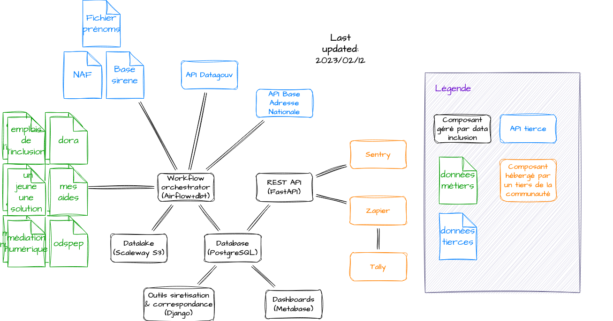
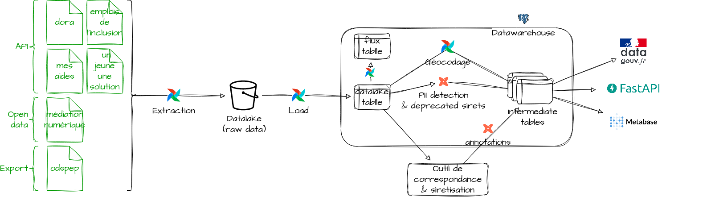

# `data-inclusion`

data·inclusion aggrège les données de l'insertion sociale et professionnelle.

## Présentation

Les sources de données traitées comprennent notamment:

* les données du GIP de l'inclusion: les emplois de l'inclusion et dora,
* les lieux de médiations numérique,
* la base de ressources partenariales de Pole Emploi,
* des données de collectivités territoriales (e.g. l'Ille-et-Vilaine)
* des acteurs publics: 1jeune1solution, mes aides de pôle emploi.

Les données collectées sont:

* historisées,
* géocodées,
* sirétisées automatiquement,
* enrichies via les outils développés par data·inclusion:
  * l'outil de correspondance, qui permet de faire correspondre 2 jeux de données brutes,
  * l'outil de sirétisation, qui permet d'attribuer un siret aux structures, afin de croiser,
* alignées sur le [schéma de données de data·inclusion](https://schema.data.gouv.fr/gip-inclusion/data-inclusion-schema/)
* publiées régulièrement en [open data sur data.gouv](https://www.data.gouv.fr/fr/datasets/referentiel-de-loffre-dinsertion-liste-des-structures-et-services-dinsertion/), la plateforme de données publiques,
* consultables via une api.

## Architecture

## Pipeline

## [Contribuer](CONTRIBUTING.md)

## [Auteurs](CODEOWNERS)

## [Licence](LICENSE)
