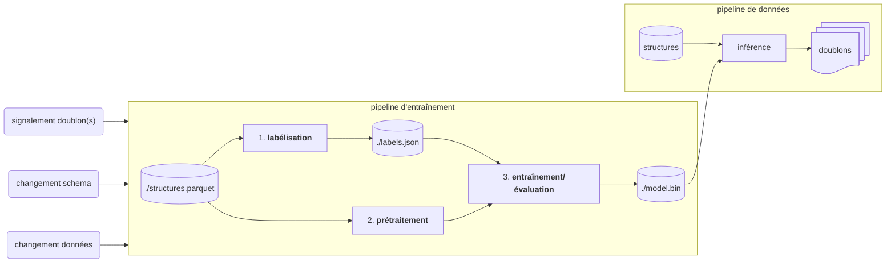

# `deduplication`

Ce dossier contient la *pipeline d'entraînement* de notre modèle de déduplication. La déduplication ne concerne que les structures à ce stade.

En partant des données structures en sortie via notre pipeline de données, nous produisons ici un modèle nous permettant d'identifier des doublons.

## Utilisation

```bash
python -m venv .venv && source .venv/bin/activate && pip install -U pip wheel setuptools && pip install -e .
```

La pipeline s'exécute via le notebook `main.ipynb`. Par exemple dans vscode en ayant installé l'extension `ms-toolsai.jupyter`.

## Architecture

Les données utilisées sont téléchargées depuis notre datalake interne [👉 ici](https://console.scaleway.com/object-storage/buckets/fr-par/data-inclusion-datalake-prod-grand-titmouse/files/data/marts/).



La pipeline d'entraînement est exécutée manuellement, via le notebook `main.ipynb`.

La pipeline d'entraînement produit un fichier binaire `model.bin`, qui sera chargé dans la pipeline de données pour dédoublonner régulièrement les structures.

La pipeline d'entraînement comprend les étapes suivantes :

### 1. labélisation

Nous maintenons une liste de paires de structures, qui ont été annotées manuellement. Chaque paire a été déclarée soit comme un doublon sans doute possible, soit comme bien distincte, soit incertaine. Ces annotations sont stockées actuellement dans le fichier `labels.json`. Afin de ne pas dépendre des données ou de leurs schémas, et de ne pas exposer de données sensibles, seuls les identifiants (stables) sont inclus.

Lorsqu'une paire de structures est examinée, 3 cas de figures sont possibles :

* les structures ne correspondent pas du tout => **non doublon**
* les structures ont un lien, mais *pourrait être distinctes* => **incertain**. Par exemple :
    * l'une est un sous-service de l'autre
    * ou dépend fortement de l'autre dans son fonctionnement (e.g. une mairie et son ccas)
* si les données correspondent (à l'erreur de saisie près), et qu'il n'y a pas de doute => **doublon**

Toutes les paires incertaines devront idéalement nous conduire :

* à préciser notre définition du concept de structure
* et/ou à enrichir nos données pour permettre de les distinguer

### 2. prétraitement

Les données sont adaptées pour améliorer les performances du modèle. Ainsi on peut exclure certaines données aberrantes. Ou bien effectuer des nettoyages supplémentaires qui n'ont pas vocation à être appliquées en amont ou au contraire, qui n'ont pas encore été intégrées à la pipeline de données.

### 3. entraînement/évaluation

Les données annotées sont réparties (pseudo-)aléatoirement en deux : jeu d'entraînement et de test.

Le seul algorithme actuellement considéré est celui proposé par [dedupe](https://github.com/dedupeio/dedupe). Cet algorithme crée des clusters de structures "proches".

A partir du jeu d'entraînement, nous entrainons plusieurs versions en variant les paramètres disponibles. Puis nous évaluons et comparons les performances obtenues grâce au jeu de test.

Notre objectif est de minimiser l'impact négatif cumulé des doublons et de notre déduplication. Il y a un compromis à trouver entre doublons non détectés et faux doublons. A date, nous privilégeons les doublons non détectés.

Nous sélectionnons la version la plus intéressante selon ce compromis. Le modèle est stocké dans le fichier `model.bin`. C'est ce fichier qui sera déployé dans la pipeline de données.

A titre d'exploration, nous exécutons le modèle sur la totalité du dataset pour explorer les clusters générés et en valider la cohérence : le nombre de clusters, la taille des clusters, les liens entre les différentes sources de données.

### 4. maintenance

Le modèle devra être réentrainé régulièrement pour tenir compte :

* des (non-)doublons remontés du terrain
* des évolutions du schéma
* de l'évolution des données
