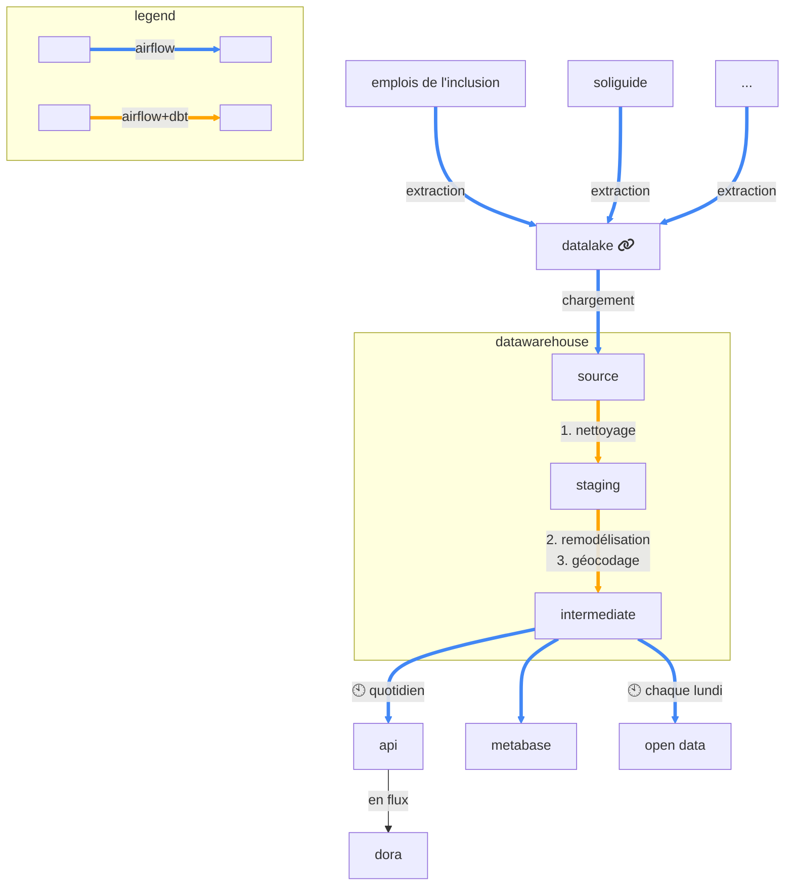

# `data-inclusion-scripts`

Ce dépôt contient des workflows (airflow) pour le traitement des données de l'inclusion.

## Pipeline

## Outils

### airflow

|      |                                                                               |
|------|-------------------------------------------------------------------------------|
| dev  | http://localhost:8080                                                         |
| prod | [lien 🔗](https://data-inclusion-scripts-staging.osc-secnum-fr1.scalingo.io/) |

### datalake

|      |                                                                                                    |
|------|----------------------------------------------------------------------------------------------------|
| dev  | Utiliser la cli `mc`                                                                               |
| prod | [lien 🔗](https://console.scaleway.com/object-storage/buckets/fr-par/data-inclusion-lake/explorer) |

### metabase

|      |                                                          |
|------|----------------------------------------------------------|
| dev  | ❌                                                        |
| prod | [lien 🔗](https://metabase.data.inclusion.gouv.fr/) |

### open data

[lien 🔗](https://www.data.gouv.fr/fr/datasets/referentiel-de-loffre-dinsertion-liste-des-structures-et-services-dinsertion/)

### api

|      |                                                                                                    |
|------|----------------------------------------------------------------------------------------------------|
| dev  | http://localhost:8000/api/v0/docs                                                                               |
| prod | [lien 🔗](https://api.data.inclusion.gouv.fr/api/v0/docs) |

## [Contribuer](CONTRIBUTING.md)
